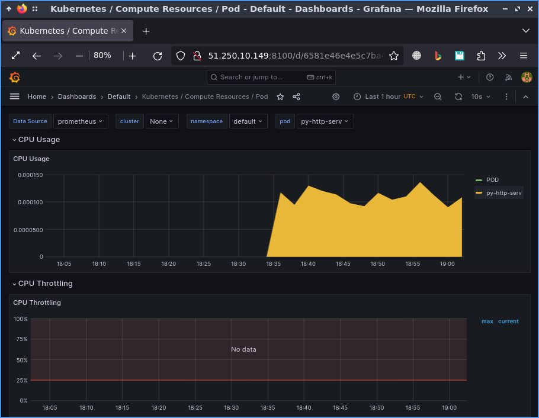
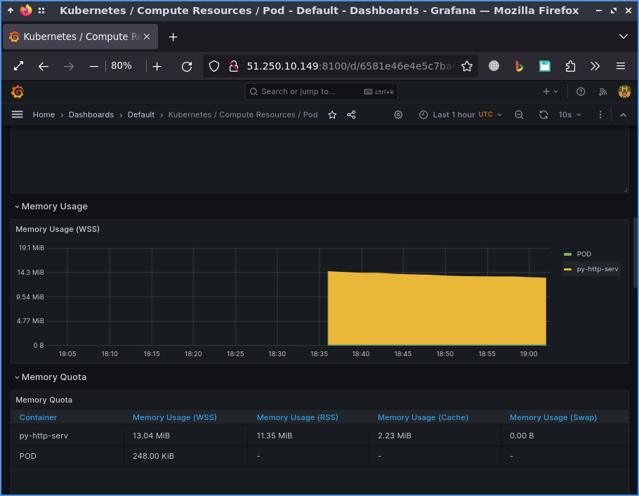

# 2022_2023-application-containerization-and-orchestration-k4112c-fedotov_p_s-azatova_g_j

## Absract

This repository contains the Connect 4 game. The functionality of the application provides for the possibility of playing over the network and watching the match by transmitting the corresponding link.

## Technologies

This repository contains the Connect 4 game. The functionality of the application provides for the possibility of playing over the network and watching the match by transmitting the corresponding link.

The application is implemented based on programming languages:  
- python (backend),  
- JavaScript (frontend)

Html and css are used for markup.

The WebSockets was used to build communication between backend and frontend.

The kube-prometheus is used to make monitoring

## Quick start

### Alias

```bash
alias kubectl='minikube kubectl --'
```

### Monitoring

```
# Start minikube
minikube delete && minikube start --kubernetes-version=v1.23.0 --bootstrapper=kubeadm --extra-config=kubelet.authentication-token-webhook=true --extra-config=kubelet.authorization-mode=Webhook --extra-config=scheduler.bind-address=0.0.0.0 --extra-config=controller-manager.bind-address=0.0.0.0

# Ensure the metrics-server addon is disabled on minikube
minikube addons disable metrics-server

# Clone git repo
git clone https://github.com/prometheus-operator/kube-prometheus

# Create the monitoring stack using the config in the manifests directory
kubectl apply --server-side -f manifests/setup
kubectl wait \
	--for condition=Established \
	--all CustomResourceDefinition \
	--namespace=monitoring
kubectl apply -f manifests/

# Minikube port forwarding
kubectl port-forward service/grafana -n monitoring --address=0.0.0.0 8100:3000 &> /dev/null &
```

### Connect 4 application

```
# Clone repo
git clone https://github.com/pp241103/2022_2023-application-containerization-and-orchestration-k4112c-fedotov_p_s.git

cd 2022_2023-application-containerization-and-orchestration-k4112c-fedotov_p_s/infrastructure

# Apply manifests
kubectl apply -f py-http-serv-pod.yaml
kubectl apply -f ws-serv-pod.yaml
kubectl apply -f python-http-server-service.yaml
kubectl apply -f ws-server-service.yaml

# Port forwarding
kubectl port-forward service/py-http-serv-service --address 0.0.0.0 8080:8080 &
kubectl port-forward service/ws-serv-service --address 0.0.0.0 8001:8001 &
```

Insert to address bar of your browser "http://<your IP address>:8080/"

## Installation

To get code clone the repo

```
git clone https://github.com/pp241103/2022_2023-application-containerization-and-orchestration-k4112c-fedotov_p_s.git
```

Change the directory to infrastructure dir of the local repositry.

```
cd 2022_2023-application-containerization-and-orchestration-k4112c-fedotov_p_s/infrastructure
```

Apply manifests for creating http-server and ws-server pods.  
Then apply manifests for creating services for http-server and ws-server pods.  

```
kubectl apply -f py-http-serv-pod.yaml
kubectl apply -f ws-serv-pod.yaml
kubectl apply -f python-http-server-service.yaml
kubectl apply -f ws-server-service.yaml
```

To make services availabe perform port-forwarding

```
kubectl port-forward service/py-http-serv-service --address 0.0.0.0 8080:8080 &
kubectl port-forward service/ws-serv-service --address 0.0.0.0 8001:8001 &
```

Open the game in your browser. Insert to address bar of your browser "http://<your IP address>:8080/"

## How to use?

Open the game in your browser. Insert to address bar of your browser "http://<your IP address>:8080/"

## Delete

```
# Delete cluster
minikube delet
minikube stop
```

## Screenshots

Images in docker hub

  

Just pushed via GitHub actions

  

Succed action

  

Monitoring of py-http-pod

  

Monitoring of websocket server pod

  

The game proccess

  

The game from another player view


## Author

Fedotov P

Azatova G
